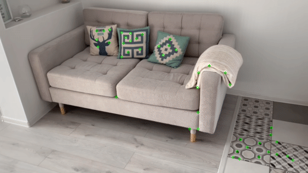
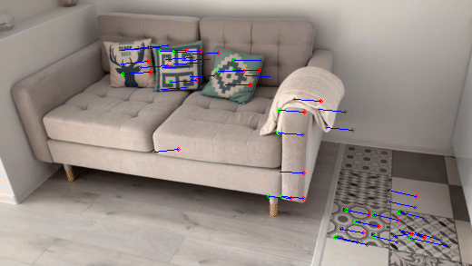
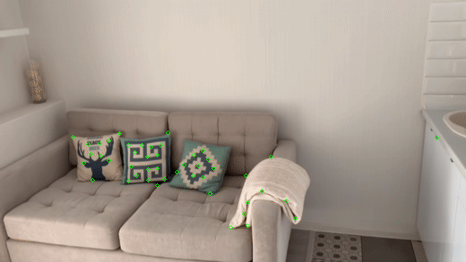
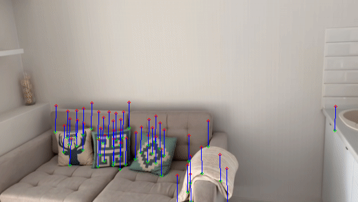

# Pyramidal Implementation of the Lucas Kanade Feature Tracker
___

### Installation

To run this project on MacOS, follow these steps.

#### Installing OpenCV
To install OpenCV using Homebrew, open a terminal and enter the following command:

```bash
brew install opencv
```

#### Preparing directories
Create directories for input and output data:

```bash
mkdir inputs
mkdir outputs
```

#### Extracting frames from GIF
Use ffmpeg to extract frames from a GIF file. Before running this command, make sure that the 4.gif file is in a folder one level above your current working directory.

```bash
cd inputs
ffmpeg -i ../4.gif frame_%03d.png
```

### Examples
#### Horizontal movement
frame 015 before features tracking

frame 025 after features tracking, we can see how every point moved to new position.


#### Vertical movement
frame 55 before features tracking

frame 65 after features tracking, we can see how every point moved to new position.
